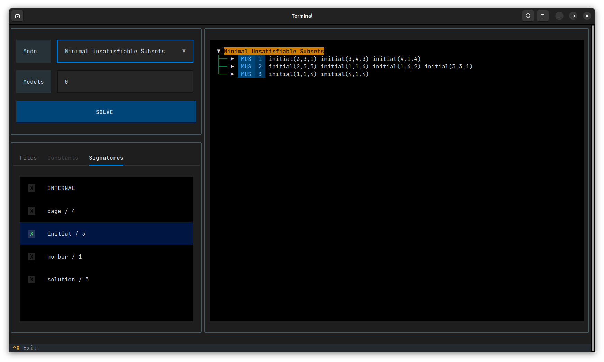
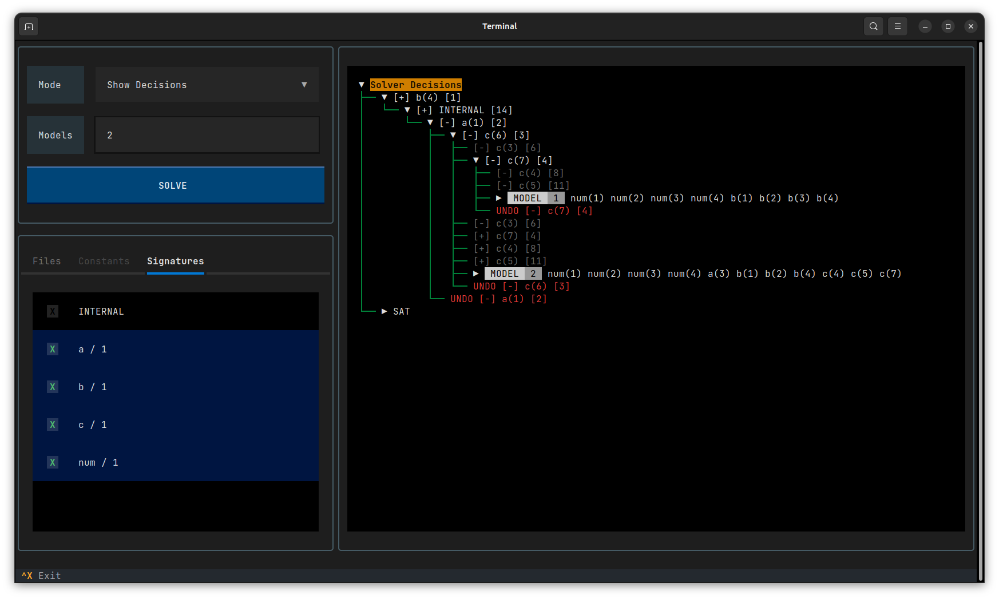

# clingexplaid

Tools to aid the development of explanation systems using clingo

## Installation

Clingo-Explaid easily be installed with `pip`:

```bash
pip install clingexplaid
```

### Requirements

- `python >= 3.9`
- `clingo >= 5.7.1`

### Building from Source

Please refer to [DEVELOPEMENT](DEVELOPMENT.md)

## Usage

Run the following for basic usage information:

```bash
clingexplaid -h
```

### Interactive Mode

We provide an interactive terminal user interface (textual) where all modes are
accessible in an interactive format. You can start this mode by using the
command below.

```bash
clingexplaid <files> --interactive
```

#### Example: MUS Sudoku

Below is one Example call using our [Sudoku Example](examples/sudoku).

```bash
clingexplaid examples/sudoku/encoding.lp examples/sudoku/instance.lp --interactive
```



#### Example: Show Decisions

This Example shows the interactive Solver Decision Tree generated from
[`examples/misc/sat_simple.lp`](examples/misc/sat_simple.lp).



### Clingo Application Class

The clingexplaid CLI (based on the `clingo.Application` class) extends clingo
with `<method>` and `<options>`.

```bash
clingexplaid <method> <options>
```

- `<method>`: specifies which Clingexplaid method is used (Required)
  - Options:
    - `--muc`:
      - Computes the Minimal Unsatisfiable Cores (MUCs) of the provided
        unsatisfiable program
    - `--unsat-constraints`:
      - Computes the Unsatisfiable Constraints of the unsatisfiable program
        provided.
    - `--show-decisions`:
      - Visualizes the decision process of clasp
- `<options>`: Additional options for the different methods
  - For `--muc`:
    - `-a`, `--assumption-signature`: limits which facts of the current program
      are converted to choices/assumptions for finding the MUCs (Default: all
      facts are converted)
  - For `--show-decisions`:
    - `--decision-signature`: limits which decisions are shown in the
      visualization (Default: all atom's decisions are shown)

### Examples

Given the simple program below [`simple.lp`](examples/misc/simple.lp) we want
to find the contained MUC (Minimal Unsatisfiable Core).

```
a(1..5).
b(5..10).

:- a(X), b(X).
```

For this we can call `clingexplaid` the following way:

```bash
clingexplaid examples/misc/simple.lp --muc 0
```

This converts all facts of the program to choices and assumptions and returns
the contained MUC from that.

```
MUC  1
b(5) a(5)
```

A selection of more examples can be found [here](examples)
