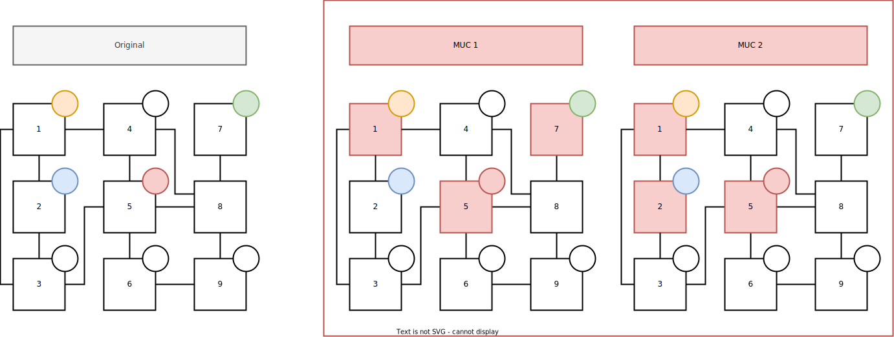

# Example : Graph Coloring

- This example encodes the classic graph coloring problem together with an
  unsatisfiable instance
- Here for the sake of illustration some of the graph nodes are already
  assigned a color from the start, which is where the conflict occurs
- Using `clingexplaid` we can discover the underlying Minimal Unsatisfiable
  Cores (MUCs) and their respective unsatisfiable constraints

## Visualization



## Run

- Finding all MUCs

  ```bash
  clingexplaid 0 encoding.lp instance.lp --muc -a assign/2
  ```

  Expected Output:

  ```bash
  MUC  1
  assign(1,green) assign(5,red) assign(7,green)
  MUC  2
  assign(1,green) assign(2,blue) assign(5,red)
  ```

- Finding the unsatisfiable constraints

  ```bash
  clingexplaid 0 encoding.lp instance.lp --unsat-constraints
  ```

  Expected Output:

  ```bash
  Unsat Constraints
  :- edge(N1,N2); assign(N1,C); assign(N2,C).
  ```

- Combined call with unsatisfiable constraints for every found MUC

  ```bash
  clingexplaid 0 encoding.lp instance.lp --muc --unsat-constraints -a assign/2
  ```

  Expected Output:

  ```bash
  MUC  1
  assign(1,green) assign(5,red) assign(7,green)
  ├── Unsat Constraints
  ├──:- edge(N1,N2); assign(N1,C); assign(N2,C).
  MUC  2
  assign(1,green) assign(2,blue) assign(5,red)
  ├── Unsat Constraints
  ├──:- edge(N1,N2); assign(N1,C); assign(N2,C).
  ```
