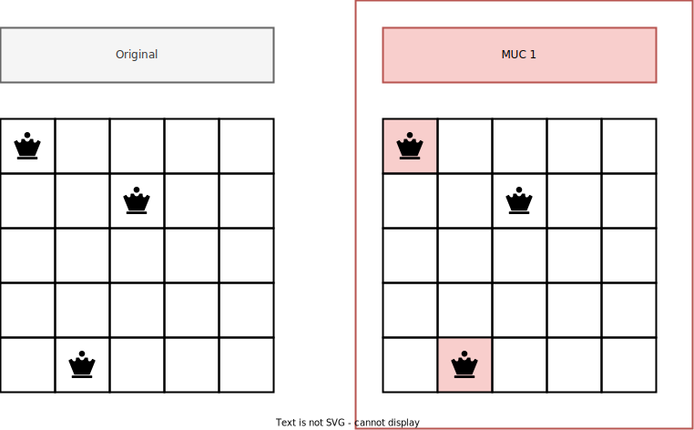

# Example : N Queens Problem

- This example encodes the classic n queens problem
- The correct problem encoding is provided with an unsatisfiable instance
- Using `clingexplaid` we can discover the underlying Minimal Unsatisfiable
  Cores (MUCs) and their respective unsatisfiable constraints

## Visualization



## Run

- Finding all MUCs

  ```bash
  clingexplaid 0 encoding.lp instance.lp --muc -a queen/2
  ```

  Expected Output:

  ```bash
  MUC  1
  queen(1,1) queen(2,5)
  ```

- Finding the unsatisfiable constraints

  ```bash
  clingexplaid 0 encoding.lp instance.lp --unsat-constraints
  ```

  Expected Output:

  ```bash
  Unsat Constraints
  :- 2 <= { queen((D-J),J) }; D = (2..(2*n)).
  :- 2 <= { queen((D+J),J) }; D = ((1-n)..(n-1)).
  ```

- Combined call with unsatisfiable constraints for every found MUC

  ```bash
  clingexplaid 0 encoding.lp instance.lp --muc --unsat-constraints -a queen/2
  ```

  Expected Output:

  ```bash
  MUC  1
  queen(1,1) queen(2,5)
  ├── Unsat Constraints
  ├──:- 2 <= { queen((D-J),J) }; D = (2..(2*n)).
  ```
