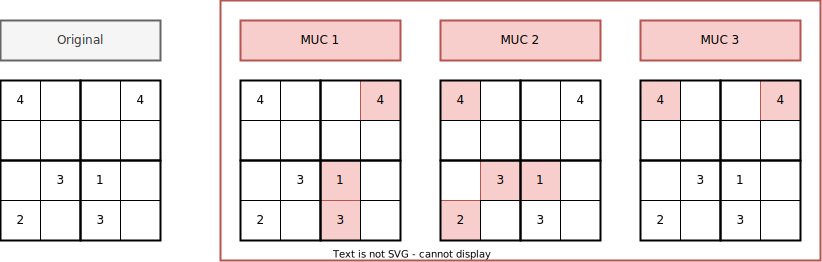

# Example : Sudoku

- This example is a 4 by 4 sudoku encoding which is given an unsatisfiable
  instance
- Using `clingexplaid` we can discover the underlying Minimal Unsatisfiable
  Cores (MUCs) and their respective unsatisfiable constraints

## Visualization



## Run

- Finding all MUCs

  ```bash
  clingexplaid 0 encoding.lp instance.lp --muc -a initial/3
  ```

  Expected Output:

  ```bash
  MUC  1
  initial(4,1,4) initial(3,3,1) initial(3,4,3)
  MUC  2
  initial(1,1,4) initial(1,4,2) initial(2,3,3) initial(3,3,1)
  MUC  3
  initial(1,1,4) initial(4,1,4)
  ```

- Finding the unsatisfiable constraints

  ```bash
  clingexplaid 0 encoding.lp instance.lp --unsat-constraints
  ```

  Expected Output:

  ```bash
  Unsat Constraints
  :- solution(X1,Y,N); solution(X2,Y,N); X1 != X2.
  ```

- Combined call with unsatisfiable constraints for every found MUC

  ```bash
  clingexplaid 0 encoding.lp instance.lp --muc --unsat-constraints -a initial/3
  ```

  Expected Output:

  ```bash
  MUC  1
  initial(4,1,4) initial(3,3,1) initial(3,4,3)
  ├── Unsat Constraints
  ├──:- solution(X,Y1,N); solution(X,Y2,N); Y1 != Y2.
  MUC  2
  initial(1,1,4) initial(1,4,2) initial(2,3,3) initial(3,3,1)
  ├── Unsat Constraints
  ├──:- solution(X,Y1,N); solution(X,Y2,N); Y1 != Y2.
  MUC  3
  initial(1,1,4) initial(4,1,4)
  ├── Unsat Constraints
  ├──:- solution(X1,Y,N); solution(X2,Y,N); X1 != X2.
  ```
